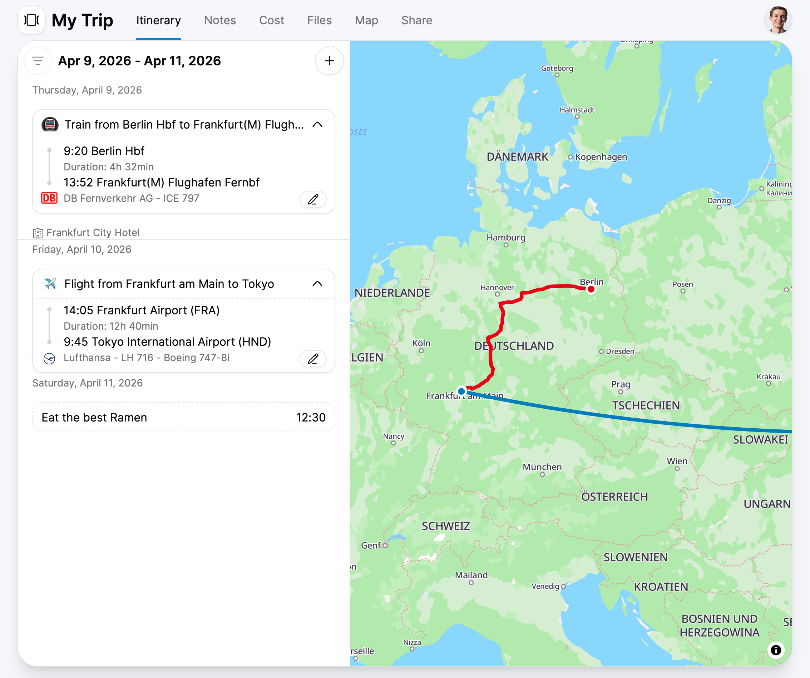

# kompass

*A local-first, encrypted travel planner with collaborative features*

## Features

- **Local-first & End-to-end encrypted** - Your data stays on your device, encrypted from end to end
- **Real-time collaboration** - Plan trips together with friends and family
- **Smart flight & train tracking** - Add transportation by flight/train number and get automatic updates
- **Push notifications** - Stay informed about schedule changes
- **Progressive Web App** - Install on any device, works offline
- **Free and open source** - No subscriptions, no lock-in

## Tech Stack

- **app/** - React-based Progressive Web App
  - Built with: React, Vite, TailwindCSS, Tanstack Router, MapLibre GL
- **transportation-api/** - Go service for flight/train data
  - Built with: Go, Fiber framework
- **server-worker/** - Effect TS background worker for schedule monitoring
  - Built with: Bun, Effect, web-push
- **sync-server/** - Dockerized Jazz sync server for real-time collaboration
  - Built with: Jazz
