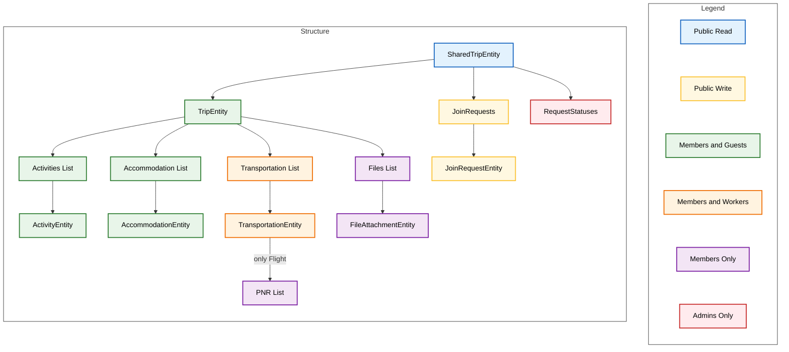

# Jazz Schema & Permissions

This document outlines the permission structure for the Trip domain, including access levels for different user roles (Admin, Member, Guest, Worker).

## Permissions for Testing

Use the following access matrix to verify permission logic in unit tests.

### Resolved Access Matrix

| Scope / Entity | Public | Guest | Member | Admin | Worker |
| :--- | :---: | :---: | :---: | :---: | :---: |
| **SharedTrip** | Read | Read | Read | Read/Write | Read |
| **Trip (General)** | - | Read/Write | Read/Write | Read/Write | - |
| **Transportation** | - | Read/Write | Read/Write | Read/Write | Read/Write |
| **PNRs (Flights)** | - | - | Read/Write | Read/Write | - |
| **Files** | - | - | Read/Write | Read/Write | - |
| **JoinRequests** | Create | Create | Create | Read/Write | Create |
| **RequestStatuses**| - | - | - | Read/Write | - |

### Key Testing Invariants

When writing schema tests, verify these invariants:

1.  **File Privacy**: `Guest` users must **never** be able to read `FileAttachmentEntity` or the `files` list.
2.  **PNR Privacy**: `Guest` users must **never** be able to read `PnrEntity` (Flight PNRs).
3.  **Worker Restrictions**: `Worker` users must **not** be able to read `TripEntity` or `PnrEntity`. They strictly access `TransportationEntity`.
4.  **Admin Supremacy**: `Admin` users must have `Read/Write` access to **all** entities.
5.  **Public Isolation**: Unauthenticated/Public users can **only** read the `SharedTripEntity` (root) and create `JoinRequestEntity` items. They must not see any internal Trip data.